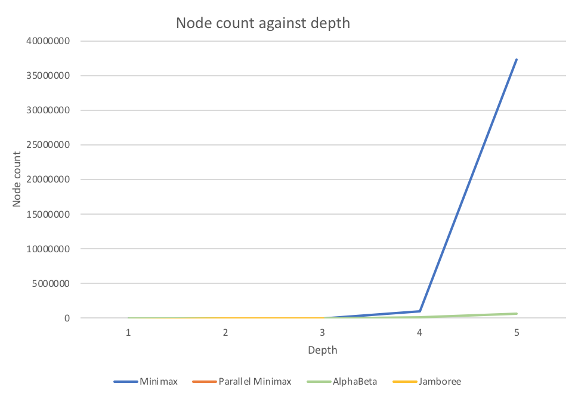
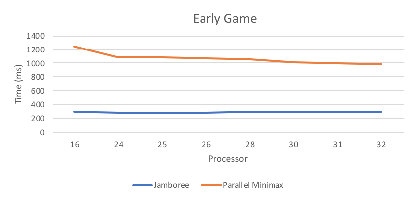

# Project 3 (Chess) Write-Up #
--------

## Project Enjoyment ##
- How Was Your Partnership?
  <pre>It was great.</pre>
   
- What was your favorite part of the project?
  <pre>Watching my chess bot beat other bots.</pre>

- What was your least favorite part of the project?
  <pre>Writing jamboree as it was a long process.</pre>

- How could the project be improved?
  <pre>Clearer instructions on how to optimize jamboree.</pre>

- Did you enjoy the project?
  <pre>Yes.</pre>
    
-----

## The Chess Server ##
- When you faced Clamps, what did the code you used do?  Was it just your jamboree?  Did you do something fancier?
  <pre>We implemented a comparator which sorted the moves so we get the best moves at the front so we 
  can get better alpha beta values. We also played around with the cut off values and depth values to give 
  the optimum speed.
  </pre>

- Did you enjoy watching your bot play on the server?  Is your bot better at chess than you are?
  <pre>Yes I enjoyed watching my bot beat the opposing bot. The bot is indeed better than me
  in playing chess because my lack of experience doesn't let me foresee 5 steps ahead like
  how my bot can.</pre>

- Did your bot compete with anyone else in the class?  Did you win?
  <pre>Yes.Yes.</pre>

- Did you do any Above and Beyond?  Describe exactly what you implemented.
  <pre>No</pre>

## Experiments ##

### Chess Game ###

#### Hypotheses ####
Suppose your bot goes 3-ply deep.  How many game tree nodes do you think
it explores (we're looking for an order of magnitude) if:
 - ...you're using minimax?
    <pre>100000</pre>
 - ...you're using alphabeta?
    <pre>50000</pre>

#### Results ####
Run an experiment to determine the actual answers for the above.  To run
the experiment, do the following:
1. Run SimpleSearcher against AlphaBetaSearcher and capture the board
   states (fens) during the game.  To do this, you'll want to use code
   similar to the code in the testing folder.
2. Now that you have a list of fens, you can run each bot on each of them
   sequentially.  You'll want to slightly edit your algorithm to record the
   number of nodes you visit along the way.
3. Run the same experiment for 1, 2, 3, 4, and 5 ply. And with all four
   implementations (use ply/2 for the cut-off for the parallel
   implementations).  Make a pretty graph of your results (link to it from
   here) and fill in the table here as well:


|      Algorithm     | 1-ply | 2-ply | 3-ply | 4-ply | 5-ply |
| :----------------: |:-----:|:-----:|:-----:|:-----:|:-----:|
|       Minimax      |   29    |  933     |   31492    |  1061080     |   37224651    |
|  Parallel Minimax  |   29    |    933   |   31492    |  1061080   |   37224651    |
|      Alphabeta     |    29   |    372   |   6398    |   63343    |   721194    |
|      Jamboree      |   29    |   388    |   6562    |  73241     |   740164    |


#### Conclusions ####
How close were your estimates to the actual values?  Did you find any
entry in the table surprising?  Based ONLY on this table, do you feel
like there is a substantial difference between the four algorithms?
<pre>Before collecting the data we made sure to run a warm up to take into consideration of the 
JVM warmup. We took the average of 5 tests so the results are more accurate.My values were
 pretty off but my hypothesis of the AlphaBeta Searcher being much faster was right.
I didn't realise how many possible moves there really was in a chess game. Based only from this table,
we can see there is a substantial difference between all the algorithms. We will compare the
sequential algorithms with each other and the parallel algorithms with each other to make a fair
comparison. The Minimax is much slower than the alpha beta searcher as the minimax's node count, 
even from the graph, increases exponential faster than the alpha beta's node count. As for the parallel
version of the Parllel minimax and the jamboree, the jamboree is faster. The parallel minimax as seen from
the graph is exponentially larger than the jamboree. There is barely any difference shown in the graph 
when comparing Alphabeta and Jamboree. Although, Jamboree has larger count it is still very close to
Alphabeta. The only significant difference was between the Alphabeta based algorithms(alphabeta and jamboree)
and the minimax based algorithms(minimax and parallel minimax).</pre>

### Optimizing Experiments ###
THE EXPERIMENTS IN THIS SECTION WILL TAKE A LONG TIME TO RUN. 
To make this better, you should use Google Compute Engine:
* Run multiple experiments at the same time, but **NOT ON THE SAME MACHINE**.
* Google Compute Engine lets you spin up as many instances as you want.

#### Generating A Sample Of Games ####
Because chess games are very different at the beginning, middle,
and end, you should choose the starting board, a board around the middle
of a game, and a board about 5 moves from the end of the game.  The exact boards
you choose don't matter (although, you shouldn't choose a board already in
checkmate), but they should be different.

#### Sequential Cut-Offs ####
Experimentally determine the best sequential cut-off for both of your
parallel searchers.  You should test this at depth 5.  If you want it
to go more quickly, now is a good time to figure out Google Compute
Engine. Plot your results and discuss which cut-offs work the best on each of
your three boards.

|      Algorithm First fen     | 1 | 2 | 3 | 4 |
| :----------------: |:-----:|:-----:|:-----:|:-----:|
|  Jamboree  |   802    |    566   |   562    |  784   | 
|      Parallel Minimax      |   1439    |   987    |   1003    |  1955     | 


|      Algorithm Mid fen     | 1 | 2 | 3 | 4 |
| :----------------: |:-----:|:-----:|:-----:|:-----:|
|  Jamboree  |   1186    |    782   |   860    |  1076   | 
|      Parallel Minimax      |   1821    |   1211    |   1259    |  2638     | 


|      Algorithm Last fen   | 1 | 2 | 3 | 4 |
| :----------------: |:-----:|:-----:|:-----:|:-----:|
|  Jamboree  |   228    |    142   |   172    |  230   | 
|      Parallel Minimax      |   601    |   394    |   423    |  888     | 


<pre>Before collecting the data we made sure to run a warm up to take into consideration of the 
JVM warmup. We took the average of 5 tests so the results are more accurate.The best 
cut-off for the Jamboree is 2 as it shows from the table of data.
The best cut off for the parallel searcher is the 3 as the tables of data have shown
consistency in the cut off of 2 being the fastest.</pre>

#### Number Of Processors ####
Now that you have found an optimal cut-off, you should find the optimal
number of processors. You MUST use Google Compute Engine for this
experiment. For the same three boards that you used in the previous 
experiment, at the same depth 5, using your optimal cut-offs, test your
algorithm on a varying number of processors.  You shouldn't need to test all 32
options; instead, do a binary search to find the best number. You can tell the 
ForkJoin framework to only use k processors by giving an argument when
constructing the pool, e.g.,
```java
ForkJoinPool POOL = new ForkJoinPool(k);
```
Plot your results and discuss which number of processors works the best on each
of the three boards.

|      Algorithm Early Game     | 16 | 24 | 25 | 26| 28| 30| 31| 32 |
| :----------------: |:-----:|:-----:|:-----:|:-----:|:-----:|:-----:|:-----:|:-----:|
|  Jamboree  |   296    |    286   |   281    |  290   |    291    |    294   |   293    |  293   |
|      Parallel Minimax      |   1240    |   1086    |   1084    |  1068     |    1062    |    1010   |   994    |  981   |



|      Algorithm Mid Game     | 16 | 24 | 25 | 26| 28| 30| 31| 32 |
| :----------------: |:-----:|:-----:|:-----:|:-----:|:-----:|:-----:|:-----:|:-----:|
|  Jamboree  |   842    |    818   |   798    |  852   |    862    |    866   |   874    |  870   |
|      Parallel Minimax      |   1539    |   1257    |   1247    |  1236    |    1229    |    1192   |   1153    |  1135   |


|      Algorithm End Game    |  16 | 24 | 25 | 26| 28| 30| 31| 32 |
| :----------------: |:-----:|:-----:|:-----:|:-----:|:-----:|:-----:|:-----:|:-----:|
|  Jamboree  |   178    |    168   |   158    |  184   |    176    |    180   |   182    |  180   |
|      Parallel Minimax      |   574    |   451    |   444    |  442     |    440    |    430   |   421    |  409   |


<pre>Before collecting the data we made sure to run a warm up to take into consideration of the 
JVM warmup. We took the average of 5 tests so the results are more accurate. From the three 
boards it seems like the best number of processors for Jamboree is 25. The results 
are very consistent with this. The Parallel Minimax's best number of processors is 32.</pre>

#### Comparing The Algorithms ####
Now that you have found an optimal cut-off and an optimal number of processors, 
you should compare the actual run times of your four implementations. You MUST
use Google Compute Engine for this experiment (Remember: when calculating
runtimes using *timing*, the machine matters).  At depth 5, using your optimal 
cut-offs and the optimal number of processors, time all four of your algorithms
for each of the three boards.

Plot your results and discuss anything surprising about your results here.

|      Algorithm     | Early Game | Mid Game | End Game |
| :----------------: |:----------:|:--------:|:--------:|
|       Minimax      |      14012.45      |     16524.95     |   6531.1       |
|  Parallel Minimax  |     1032.2       |     1293.6     |     465.75     |
|      Alphabeta     |    324.05        |     759.9     |      216.95    |
|      Jamboree      |       342.85     |    465.1      |     87     |


<pre>We notice that the difference in the improvement from Minimax to Parallel Minimax is huge compared
to the improvement from AlphaBeta to Jamboree. We suspect the difference between AlphaBeta to Jamboree
is not huge because the depth we explore is only 5, the we theorize that the gain in efficiency from
the pruning will become more substantial if Jamboree explore a greater depth.</pre>


### Beating Traffic ###
In the last part of the project, you made a very small modification to your bot
to solve a new problem.  We'd like you to think a bit more about the 
formalization of the traffic problem as a graph in this question.  
- To use Minimax to solve this problem, we had to represent it as a game. In
  particular, the "states" of the game were "stretches of road" and the valid
  moves were choices of other adjacent "stretches of road".  The traffic and
  distance were factored in using the evaluation function.  If you wanted to use
  Dijkstra's Algorithm to solve this problem instead of Minimax, how would you
  formulate it as a graph?
  <pre>To get from point A to point B there will be nodes which will represent the roads
  available. Each node will be connected to each other accordingly to form a path.
  There will be edges with costs between nodes which indicate the amount of time it
  takes to get from one road to another. Point A and point B will be represented as nodes
  despite them not necessarily being roads. The nodes will have some way to save possible paths 
  it has to connect to other nodes. With the nodes and the edge set up we can use
  the algorithm to solve this problem.</pre>

- These two algorithms DO NOT optimize for the same thing.  (If they did,
  Dijkstra's is always faster; so, there would be no reason to ever use
  Minimax.)  Describe the difference in what each of the algorithms is
  optimizing for.  When will they output different paths? 
  <pre>Dijkstra's algorithm optimizes by returning the absolute shortest path. The 
  absolute shortest path means it returns the shortest path given that the path
  its taking will be tha path that takes the least amount of time. For the Minimax
  it optimizes by finding the best path that you will have the least traffic. Nature
  will force the driver to take a path which has the most traffic after the driver has made
  a choice on the path it wants to take. The Minimax will find a way to basically foresee
  which path nature will take the driver to and will give the best path path to take given 
  that nature will always force the driver into the path with the most traffic. 
  The paths outputted will be different from each other most of the time. As long as
  there are 2 paths to the same destination, the outputs path will be different.
  The Dijkstra's algorithm will return the absolute path but the minimax will 
  often return another path as nature will always choose the next worst path
  therefore minimax doesn't always get the absolute best path./pre>