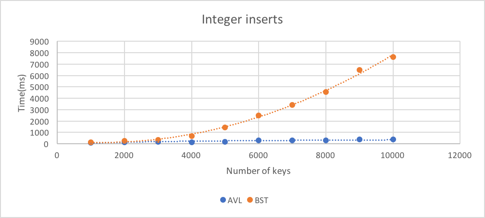
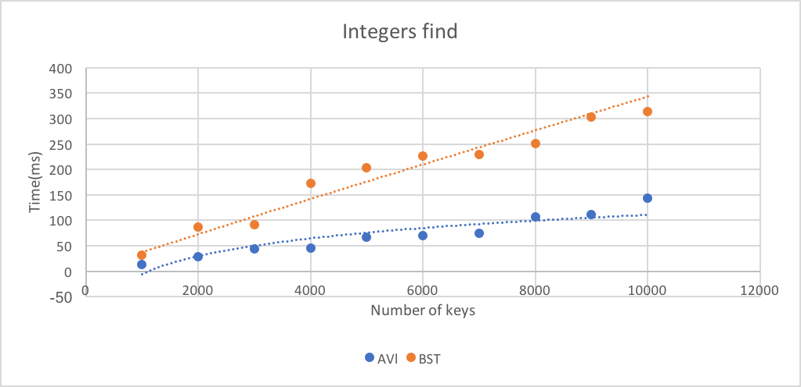
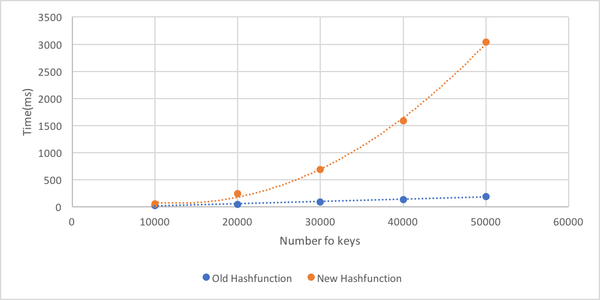

# Project 2 (uMessage) Write-Up #
--------

## Project Enjoyment ##
- What was your favorite part of the project? Why?
  <pre>The sorting was as it was the most relaxing to do.</pre>

- What was your least favorite part of the project? Why?
  <pre>The avl tree as it gave me the most amount of errors 
  and generally took the most time even though it was supposed
  to be that hard.</pre>

- How could the project be improved? Why?
  <pre>Maybe some more challenging sorts we can implement because
  the sorting was a bit too easy and I would be interested how other sorts are
  applicable to this project.</pre>

- Did you enjoy the project?  Why or why not?
  <pre>Yes, to see the Umessage work after a months long worth of work using 
  very relevant thing we learned in class was redeeming.</pre>
    
-----

## Experiments ##
Throughout p1 and p2, you have written (or used) several distinct implementations of the Dictionary interface:
 - HashTrieMap 
 - MoveToFrontList
 - BinarySearchTree
 - AVLTree
 - ChainingHashTable
 
 In this Write-Up, you will compare various aspects of these data structures.  This will take a significant amount of
 time, and you should not leave it to the last minute.  For each experiment, we expect you to:
 - Explain how you constructed the inputs to make your conclusions
 - Explain why your data supports your conclusions
 - Explain your methodology (e.g., if we wanted to re-run your experiment, we would be able to)
 - Include the inputs themselves in the experiments folder
 - Include your data either directly in the write-up or in the experiments folder
 - You should include graphs of the outputs for at least a few of the questions.
   You can add a link to an image following the instructions found here:
https://courses.cs.washington.edu/courses/cse332/18wi/handouts/markdown.pdf
An example can also be found at the end of this file.
 - We recommend that you keep your "N" (as in "N-gram") constant throughout these experiments. (N = 2 and N = 3 are reasonable.) 
 - You should probably run multiple trials for each data point to help remove outliers.
 - You should not need to wait for hours and hours for your program to run in
 order to answer a question.  Do use large values for N, but not so large that 
 you are waiting overnight for your program to run (N=1,000,000 is likely larger 
 than you need.).

### BST vs. AVLTree ###
Construct inputs for BST and AVLTree to demonstrate that an AVL Tree is asymptotically better
than a Binary Search Tree. Comparing the worst case for each structure is fine here. 
To do this, we expect you to show trends.  You might consider fitting a curve to
your results. Explain your intuition on why your results are what they are.
<pre>
How I conducted this experiment is by using a random text generator to generate 2 text files 
(numbers3.txt, numbersFinder3.txt). One txt files contains 10,000 sorted 
generated 1-7 digit numbers and the the other txt file contain 10,000 randomly generated integers 
which is unsorted to look for keys. In this experiment, the data structures will be compared based on
their performance in timings for the their find and insert function. We will be comparing them 
based on a worst case scenario. We chose 10,000 data inputs because it was already enough to show the
asymptotic difference between BST and AVL.

We will first talk about the insert function. The trendlines of the BST node display an polynomial growth
while the trendline of the AVL tree display a trend most similar to a logaritmatic curve.
This is suprising because we would expect the runtime of BST insert to be a linear curve since new data will be inserted to the right side
of everynode. To explain this, we argue that it is because when the size of BST is small the insertion runtime is very similar to AVL,
and it is only when the tree gets bigger that the linear pattern of O(n) can be seen. Our graphic software, however, attemps to connect all points together, thereby creating this somewhat polynomial graph. Meanwhile, the AVL tree has a logarithmatic
trendline because it will keep rebalancing its data so that not all the data will be on the right side of the root.
Because the data is balanced the runtime for an insert would be more like runtime of O(logN). 
It is a logarithmatic curve. Although not very obvious, we would need to zoom into the graph to see its nature. Regardless,
in both situations, the BST is clearly slower asymtotically. 

The other function is the find function. The trendlines for AVL is logarithmic and BST 
is linear. The BST is clearly slower in terms of timing. The AVL has a logarithmic curve with a smaller runtime than BST.
The BST has a linear curve likely because all of the worst case sorted data was stored to the right
of each node. Therefore the trendline shows a linear line of O(n) as it could potentially go through all the elements to insert 
the next one. The AVL tree have a trendline of O(logN). This is likely because AVL tree rebalances itself accordingly. Therefore,
we know that the tree is somewhat balanced, using the rule that every left and right subtree of a node have a max height differene
of one. Therefore, the traversal path is shorter since the height of the tree is shorter than a BST. There would be less nodes,
making it faster. Therefore the runtime of find for AVL is O(logN) and is O(n) for BST.

Since the BST has a trendline with an higher order growth namely around O(n) for insert and find while the AVL has a trendline with a 
logarithmatic growth, we can confident conclude that the AVL tree is the better datastructure
asymtotically.

</pre>

| N(keys)       | Time/ms(AVL)     | Time/ms(BST)|
| ------------- | ---------------- | ----------- |
| 1000          |       101       |   140       |  
| 2000         | 133              | 257         |
| 3000         |       173        |   349       | 
| 4000         | 144              | 673         |
| 5000         |       191        |   1443       |
| 6000         |       304        |   2500       |
| 7000         | 293              | 3426         |  
| 8000         | 314              | 4542         |
| 9000         |       361        |   6470       |
| 10000        |     391         |   7633      |

| N(keys)       | Time/ms(AVL)     | Time/ms(BST)|
| ------------- | ---------------- | ----------- |
| 1000          |       13       |   32       |  
| 2000         | 29              | 87         |
| 3000         |       44        |   91       | 
| 4000         | 46              | 172         |
| 5000         |       67        |   203       |
| 6000         |       70        |   226       |
| 7000         | 75              | 230         |  
| 8000         | 107              | 251         |
| 9000         |       112        |   303       |
| 10000        |     144         |   314      |

### ChainingHashTable ###
Your ChainingHashTable should take as an argument to its constructor the type of "chains" it uses.  Determine
which type of chain is (on average, not worst case) best: an MTFList, a BST, or an AVL Tree.  Explain your intuition on why
the answer you got makes sense (or doesn't!). 

| Function      | Time/ms(AVL)     | Time/ms(BST)| Time/ms(MTFlist) | 
| ------------- | ---------------- | ----------- | ------------ |
| insert           | 141               | 34          |    44            |
| 				|   173		|		36		|			60	|
| 				| 		189		|		47		|		46		|
| find           | 235               | 109          |     100       |
|				|	238			|		136	|		75		|
|				|		230		|		117		|			97	|
|average	 insert		|	167			|	39			|	50			|
|average	 find		|		234		|		121		|	91			|
<pre>
I tested the datastructures by storing alice.txt in to the ChainingHashTable with different types of chains.
Then I used the find function with a list of randomized strings. Using random data will likely give the 
average performance of both the data structure which will help draw the most accurate conclusion. The result 
surprised me with the find function. My initial guess to what were to happen is that the AVL tree would 
be the best in the insert and the best in the find functions. From the data, AVL trees performed the worst. 
The AVL tree being the worst in insert does not makes sense because of the way the AVL tree
was implemented which made it traverse around Log_2(n) many times while the MTF need to traverse the
whole chain to find any duplicate keys. This is surprising as we have learned in class, and implemented the AVL
tree to be more efficient that MTF. 

As for the best datastructure, the data implies the BST is the best for 
inserting the data while the best for the find function is the MTF list. For the BST being the best
for insert is a surprise because it has a worst case insert of O(N) and the MTF has a runtime of O(N).
As for the find function, it was surprising that the the AVL tree was the worst and the
MTF was the best. The runtime of an AVL tree's find is expected to be better than the BST since it is balanced. It is supposed to 
be better than the MTF because it has a logarithmatic runtime for find while the MTF has a linear runtime. One theory we proposed
is that the data that was entered is somewhat evenly spread out, taking into account the hashing of each data input, and possibly the
insufficient amount of words in alice.txt to actually demonstrate the power of AVL Tree as the inner chain of the hashtable. 
In conclusion, the BST would be the best when it came to inserting data and the MTF is the best when it came
to finding data.
</pre>
 
### Hash Functions ###
Write a new hash function (it doesn't have to be any good, but remember to include the code in your repository).
Compare the runtime of your ChainingHashTable when the hash function is varied.  How big of a difference can the
hash function make (on average, not worst case)?  (You should keep all other inputs (e.g., the chain type) constant.)  
Explain your intuition on why your results are what they are.

| N(keys)       | Time/ms (old hashfunction)    | Time/ms(new hashfunction)|
| ------------- | ---------------- | ----------- |
| 10000           | 26               | 55          |
| 20000           | 47               | 243          |
| 30000          | 86               | 692          |  
| 40000          | 132               | 1583          |
| 50000          |       194         |   3042        |

<pre>
We conducted this experiment by creating a chaining hash table with MTF list chains to keep 
consistency. We edited our CircularArrayFIFO's hashcode method, one which is faster and another one which is slower.
We conducted this experiment by inserting AlphabeticStrings object into the Hashtable, knowing that
AlphabeticStrings uses CircularArrayFIFO underneath it. Our test input are basically random 4 letters strings, and there are
100,000 of it. Using a random string would help give us a more average case scenario which we want to test for. However, we only inserted up
to 50,000 data in order to make the graph's trend clearer to the viewer. 

From the data you can see that the old hashfunction has a linear runtime,
while the new hashfunction has a polynomial runtime. The reason we think its different is because for the slower 
hashfunction, we programmed the hashCode is such a way that the hashCode returns value that are less voltatile
than the faster hashfunction, and less volatile means call to hash function of different object will produce values that
are closer to each other, which in turn mean that collision happens more, and regardless of the inner dictionary use,
more hashcode is hashed to the same "bucket" in the hashtable. For the faster hashfunction,
our intuition is that because the values returned by the hashcode is more volatile, therefore,
collision happends less meaning more object will be hashed to different bucket and be inserted as a first few
elements in each bucket, therefore insertion is faster for them.

</pre>

### General Purpose Dictionary ###
Compare BST, AVLTree, ChainingHashTable, and HashTrieMap on alice.txt.  Is
there a clear winner?  Why or why not?  Is the winner surprising to you?

| Function      | Time/ms(AVL)     | Time/ms(BST)| Time/ms(HashTriemap) |  Time/ms(ChainingHashTable) | 
| ------------- | ---------------- | ----------- | ------------ | ---------------- |
| insert           | 145               | 76          |    151            |   30            |
| 				|   132		|		68		|			161	|   34            |
| 				| 		163		|		68		|		153		|   29            |
| find           | 234               | 106          |     150       |   121            |
|				|	238			|		113	|		158		|    139            |
|				|		245		|		139		|			166	|     104            |
|average	 insert		|	147			|	71			|	155			|       31            |
|average	 find		|		239		|		119		|	158			|       121            |
<pre>
Note that I used a MTF list as the "chain" in the ChainingHashTable as it gave the best results.
A file with random string was used for the find function to add a random aspect of the test. 
Using random data will likely give the average performance of both the data structure which will 
help draw the most accurate conclusion. From the data, the data structure with the best 
performance was the ChainingHashTable. The winner seems to depend on what function is being used. 
From looking at just the insert function the ChainingHashTable is clearly the fastest as it has 
the lowest time taken among all of the datastructures. As for
the insert function the winner is either the ChainingHashTable or the BST. This is because, their average
value is too close to each other to give a definite answer. If we look at the data specifically, note that
the BST has timings, 106,113,139 and the ChainingHashTable has timings 121,139,104. This is odd because
there was two test where the BST was faster but a single test where the BST was slower. Since there
were two tests which was faster it is more likely that the BST is the better when it comes to a 
find. In conclusion, as an overall data structure storing and alice.txt and finding values from it
the ChainingHashTable is better because, it was clearly faster for an insert and it was very close to being
just as fast a BST for the find function. This is surprising as the ChainingHashTable has a runtime of
O(n) as it has MTF as a chain for both a find and insert. The other data structure had runtimes that 
were logarithmatic in nature and should have been faster in doing these functions.
</pre>

### uMessage ###
Use uMessage to test out your implementations.  Using N=3, uMessage should take less than a minute to load using
your best algorithms and data structures on a reasonable machine.

 -  How are the suggestions uMessage gives with the default corpus? (here we mean spoken.corpus or irc.corpus, not eggs.txt)
    <pre>
    The suggestions that uMessage gives is ["I", "and", "yeah", "well"] with the corpus irc.corpus. 
    It is accurate and is expected, as shown in Piazza since those words are the one that appears the most.
    As for the word suggestion itself, 
    </pre>

 - Now, switch uMessage to use a corpus of YOUR OWN text. To do this, you will need a corpus. 
   You can use anything you like (Facebook, google talk, e-mails, etc.)  We provide
   instructions and a script to format Facebook data correctly as we expect it will be the most common
   choice.  If you are having problems getting data, please come to office hours and ask for help.
   Alternatively, you can concatenate a bunch of English papers you've written together to get a corpus
   of your writing.  PLEASE DO NOT INCLUDE "me.txt" IN YOUR REPOSITORY.  WE DO NOT WANT YOUR PRIVATE CONVERSATIONS.
     * Follow these instructions to get your Facebook data: https://www.facebook.com/help/212802592074644
     * Run the ParseFBMessages program in the p2.wordsuggestor package.
     * Use the output file "me.txt" as the corpus for uMessage.
 
 - How are the suggestions uMessage gives wth the new corpus?
   <pre>
   I think the suggestion that uMessage give with the new corpus is very accurate in terms of how I usually
   talk on facebook. Reading the suggestion does remind me of the way that I like to build my sentences. In fact,
   it actually rebuilds some of the previous text I sent to other people. From the suggestion I've also notice some 
   words that I like to use often when texting, and I believe that it is quite accurate.
   </pre>

-----

A sample image:

To show you how it is done.

## Above and Beyond ##
-   Did you do any Above and Beyond?  Describe exactly what you implemented.
 <pre>
 No
 </pre>
